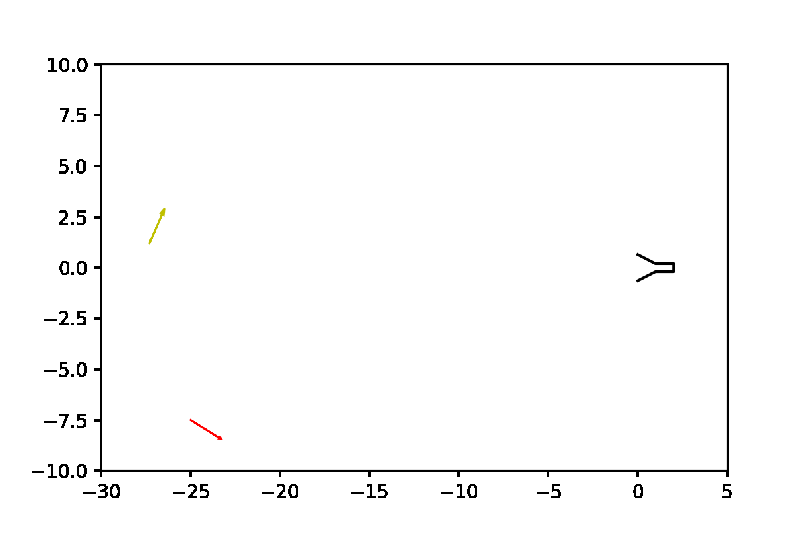
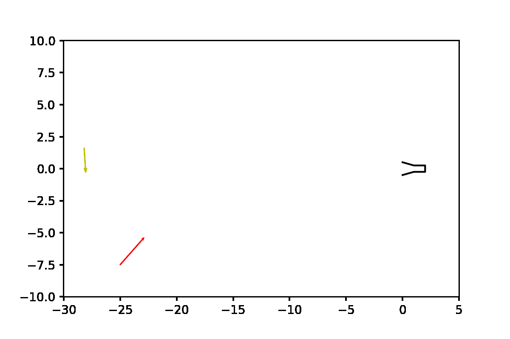

# Gymnasium environments to apply RL to AUV Docking

This package contains an environment that follow the structure of **Farama Gymnasium** to test Deep Reinforcement Learning (DRL) algorithms to a simplified docking maneuver using an autonomous underwater vehicle (AUV) into a funnel shaped docking station in the presence of currents.

## Installation

To install the environment, execute from the base folder:

```bash
pip install -e .
```

To include any of the available environemnts into a project use:

```python
import gymasium
import gym_auv
env = gym.make('Docking-v2')
```

## Docking-v2 environment

Starting at ~30m far from a Docking Station (DS), with random orientation, the goal is to dock with a velocity smaller than 0.3m/s into a funnel shaped DS with a 0.5m radius entrance. The episode finalizes if the vehicle reaches the target, it crashes with the DS or the maximum episode steps (600) are reached. The vehicle dynamics include linear and cuadratic dumping but no coriolis effect. Gravity and buoyancy are ommited (assume 2D).

The rewards function is based on:
 * Dense reward according to distance to DS and energy utilization.
 * If close to DS penalize speeds greater than desired docking speed (i.e. 0.3m/s).
 * If AUV inside DS, reward according to [J.Esteba 2021](https://www.mdpi.com/1424-8220/23/1/241) paper and terminate.
 * If collision with DS, a negative reward is obtained and the episode terminates.
 
Continuous Observation: `[dist_to_DS, angle_to_DS, auv_angle, auv_velocity_x, auv_velocity_y, auv_velocity_yaw]`
Continuous Actions: velocity `[v, w]` or predefined actions `[forward, turn]`.
Max Steps: `600`

En example of untrained policy moving forward and turning randomly can be seen below:



#### Training

An example of an agent trained in this environment for ~1500 episode using the SAC algorithm from [StableBaselines3](https://github.com/DLR-RM/stable-baselines3) implementation with default parameters is shown below:

